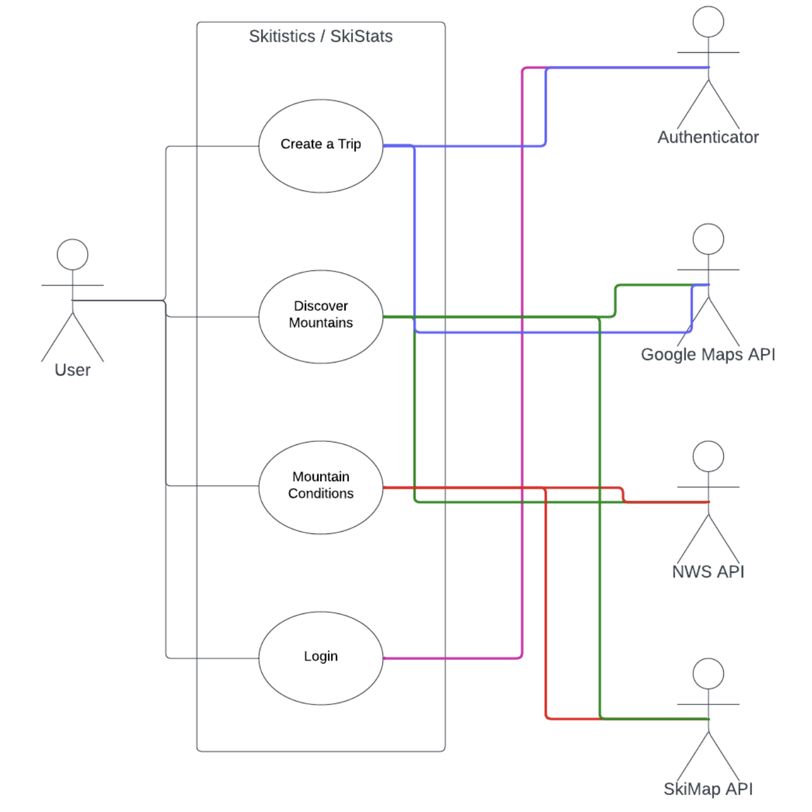
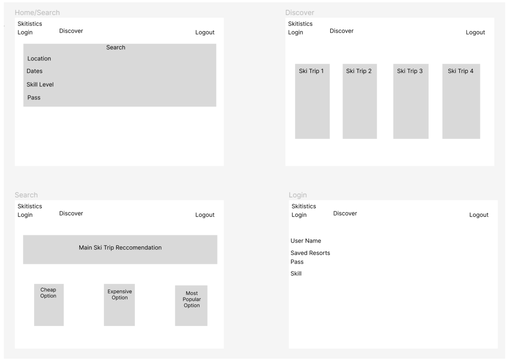

## Recitation 011- Team 4
- Logan Tilly
- Jacob McKinney
- Kobe Small
- Koral Villalobas
- Andrew Chaney
- Zaphod Schmidt

# Powder Programmers

- Github - https://github.com/KosmicAnomaly/CSCI3308-Group-Project
- Database Layout - https://editor.ponyorm.com/user/Kosmic/SkiStats

## Skitistics or SkiStats
In a world overrun by traffic and crowded mountains, Skitisticscreates and plans a ski trip for you. Users will use thisapplication similar to how AirBNB runs where they will put in anarea and days they are able to travel and this website willcreate a list of fully created ski trips. It will show the userrecommended hotel/area of stay, ski resort, and an overallPOWDER score of the trip based on its traffic, powder, andconditions. 

## Vision Statement
For the bold adventurers out there looking for the best tracks,Skitistics provides the one stop spot to create the perfect skitrip for any shredder. slay1

## Communication Plan
We have created a groupchat via phone numbers to communicatedirectly with each other and we also have our github repositoryopen to communicate.

## Meeting Plans
We will meet with our TA every Monday at 2PM and the team willmeet weekly during lab in person as well as Mondays 7-10AM inperson at a study room in CSEL. 

## Development Methodology (In Github and monitored by TA)
- Create 4 columns depicting the stages of development
- Create a few epics
- Backlog column with 5 user stories
- Add new user stories weekly to backlog

## Use Case Diagram
- Home page showing search to pick location and dates
- Once data is entered, create  full ski Itinerary (show hotels, ski resorts, etc + full cost)
- Discover page showing recommended/most popular ski itinerary/trips

https://lucid.app/lucidchart/1d630545-b3f1-466e-9877-e8d1718f474f/edit?viewport_loc=-31%2C111%2C2129%2C1122%2C0_0&invitationId=inv_9463a006-302d-481d-b05e-c83900d1ce22

## Wireframes

https://www.figma.com/file/eAvdYayHlDDNUNQVsIEJhe/Untitled?node-id=0%3A1

## APIs:
- NWS for Weather and Mountain Conditions
- Google API for directions, time to get there, and distance.
- SkiMap API for trails, location, and maps. 
   - https://skimap.org/
   - Can make JSON queries and XML to embed maps and data in our website.
- Google Hotel API for getting hotel prices

## Minimums:
- Login
- Register
- Discover style page with list of ski resorts and mountains